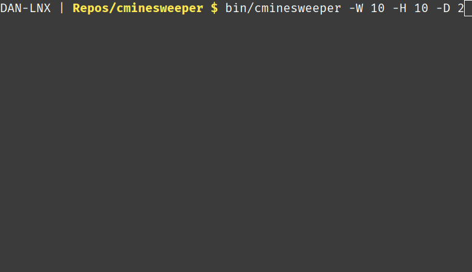

# CMinesweeper

Sometimes it's fun to reinvent the wheel. 

The aim of this project is to use NCurses to write a Minesweeper game that can be played with the mouse, and maybe to add an NPC player mode aswell. This will give me an understanding of NCurses and some more C practise, but above all this is just for fun.

## Compiling and Installing
Requires ncurses version >= 6.5 which is supplied with most modern Linux distributions. Run the makefile to compile locally.
```
make
```

To install to `/usr/local/bin`, run the makefile with the `install` option.
```
make install
```
You can uninstall with the `make uninstall` option.

## Usage
For help run with the `-h` option.
```
cminesweeper -h
```

The game is played with the left and right mouse-buttons just like the original minesweeper. Press ESC to exit.



## Terminal Requirements
You will need a colour and mouse-operable terminal. Linux terminal emulators like Gnome-Terminal and XTerm supply this functionality. I would love to try on an real old terminal one day too, but this is yet untested.
